# Diagramas de Flujo del Sistema

## Sistema de Viajes DHL - Flujos de Procesos

### Fecha: 27 de Febrero de 2026

---

## 1. FLUJO GENERAL DEL SISTEMA

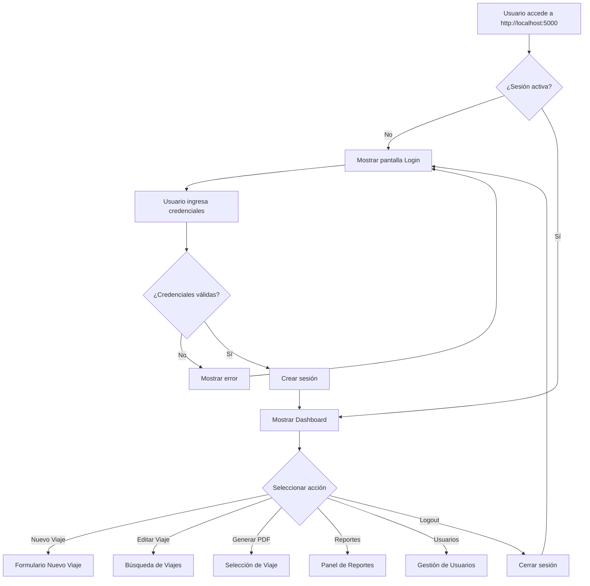

---

## 2. FLUJO DE CREACIÓN DE VIAJE

```mermaid
flowchart TD
    A[Inicio: Nuevo Viaje] --> B[Cargar formulario]
    B --> C[Llenar Información Básica]
    C --> D[Número de Viaje<br>Fecha<br>Casino<br>Administrativo]
    D --> E[Información del Transporte]
    E --> F[Tipo Camión<br>Patentes<br>Termógrafos]
    F --> G[Información del Conductor]
    G --> H{¿Conductor existe<br>en maestras?}
    H -->|Sí| I[Autocompletar RUT y Celular]
    H -->|No| J[Ingresar manualmente]
    I --> K[Fechas de Operación]
    J --> K
    K --> L[Llegada DHL<br>Salida DHL]
    L --> M[Información de Carga]
    M --> N[Pallets<br>Wencos<br>Bins]
    N --> O[Checklist de Verificación]
    O --> P[Sellos de Seguridad]
    P --> Q[Guías de Despacho]
    Q --> R[Certificación y Observaciones]
    R --> S[Agregar Centros de Costo]
    S --> T{¿Más centros?}
    T -->|Sí| U[+ Agregar Centro]
    U --> V[Por cada centro:<br>Agregar Comidas Preparadas]
    T -->|No| V
    V --> W[Guía<br>Descripción<br>Kilos<br>Bultos<br>Proveedor]
    W --> X{¿Más comidas<br>en este centro?}
    X -->|Sí| V
    X -->|No| Y{¿Validación OK?}
    Y -->|No| Z[Mostrar errores]
    Z --> C
    Y -->|Sí| AA[Click: Guardar Viaje]
    AA --> AB[Confirmar guardado]
    AB --> AC[DB: INSERT INTO viajes]
    AC --> AD[DB: INSERT INTO comidas_preparadas]
    AD --> AE{¿Conductor nuevo?}
    AE -->|Sí| AF[Agregar a maestras_choferes]
    AE -->|No| AG{¿Casino nuevo?}
    AF --> AG
    AG -->|Sí| AH[Agregar a maestras_casinos]
    AG -->|No| AI[Mostrar éxito]
    AH --> AI
    AI --> AJ[Redirigir a Dashboard]
    AJ --> AK[Fin]
```

---

## 3. FLUJO DE EDICIÓN DE VIAJE

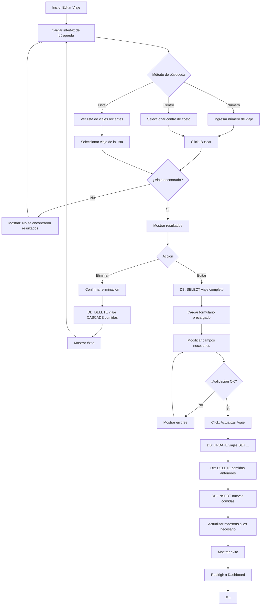

---

## 4. FLUJO DE GENERACIÓN DE PDF

```mermaid
flowchart TD
    A[Inicio: Generar PDF] --> B[Cargar interfaz]
    B --> C[Cargar dropdown con viajes]
    C --> D[Usuario selecciona número de viaje]
    D --> E[DB: SELECT centros de costo del viaje]
    E --> F[Cargar dropdown con centros]
    F --> G[Usuario selecciona centro de costo]
    G --> H[Configurar opciones de PDF]
    H --> I[Incluir logo DHL?<br>Incluir comidas?<br>Incluir sellos?<br>Espacio para firmas?]
    I --> J[Click: Generar PDF]
    J --> K[POST /api/generar-pdf]
    K --> L[DB: SELECT viaje completo WHERE numero_viaje AND centro_costo]
    L --> M[DB: SELECT comidas_preparadas WHERE viaje AND centro]
    M --> N[pdf_generator.generar_pdf]
    N --> O[ReportLab: Crear documento]
    O --> P[Agregar logo DHL]
    P --> Q[Agregar información del viaje]
    Q --> R[Agregar tabla de transporte]
    R --> S[Agregar información de conductor]
    S --> T[Agregar tabla de carga]
    T --> U[Agregar checklist]
    U --> V{¿Incluir comidas?}
    V -->|Sí| W[Agregar tabla comidas preparadas]
    V -->|No| X
    W --> X[Agregar sellos salida/retorno]
    X --> Y[Agregar guías de despacho]
    Y --> Z{¿Espacio firmas?}
    Z -->|Sí| AA[Agregar sección de firmas]
    Z -->|No| AB
    AA --> AB[Guardar PDF en /pdfs/]
    AB --> AC[Generar nombre: Viaje_Nro_Centro.pdf]
    AC --> AD[Retornar URL de descarga]
    AD --> AE[Cliente recibe response]
    AE --> AF[Navegador inicia descarga automática]
    AF --> AG[PDF descargado]
    AG --> AH[Fin]
```

---

## 5. FLUJO DE GENERACIÓN DE REPORTES EXCEL

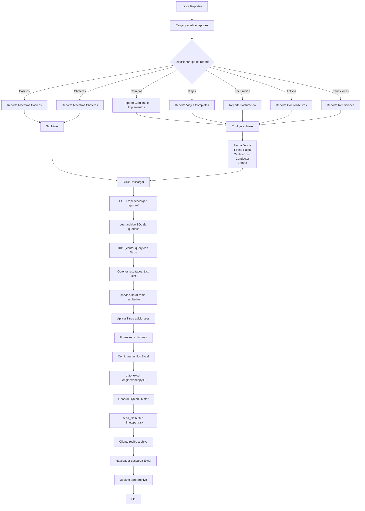

---

## 6. FLUJO DE AUTENTICACIÓN

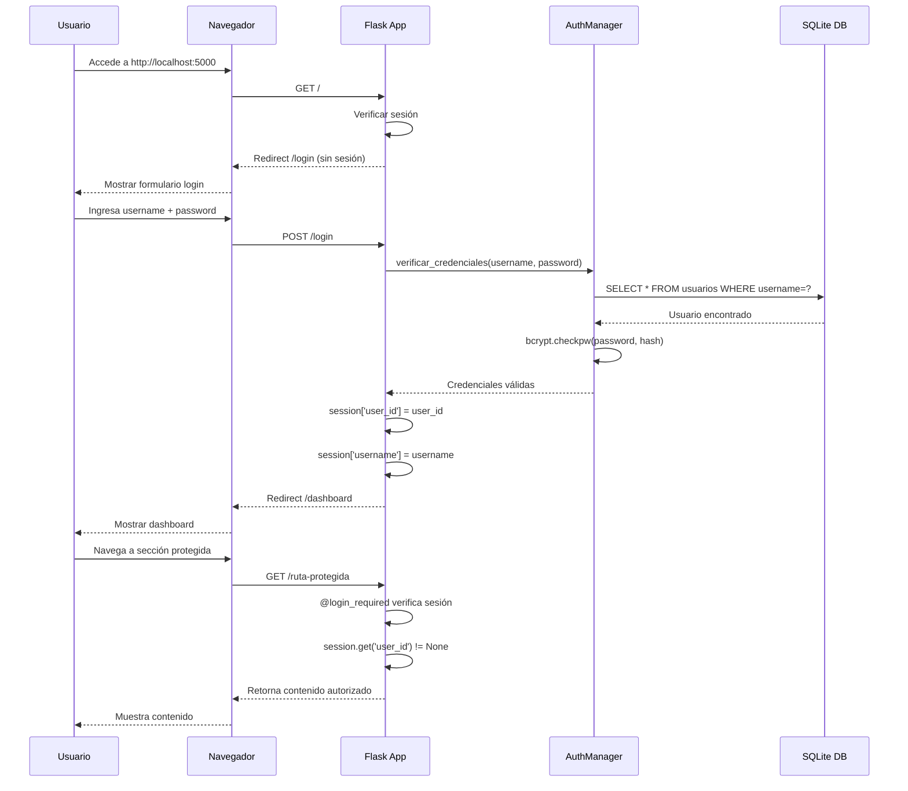

---

## 7. FLUJO DE GESTIÓN DE MAESTRAS

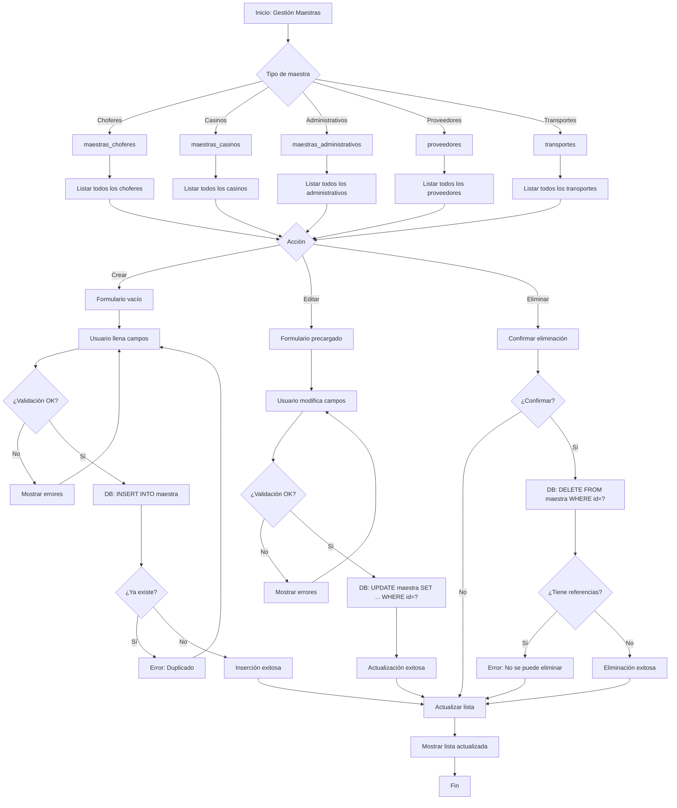

---

## 8. FLUJO DE GESTIÓN DE USUARIOS

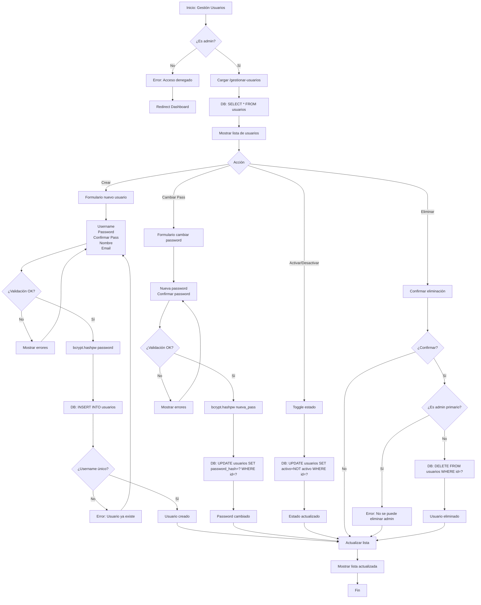

---

## 9. FLUJO DE INICIO/DETENCIÓN DEL SERVIDOR

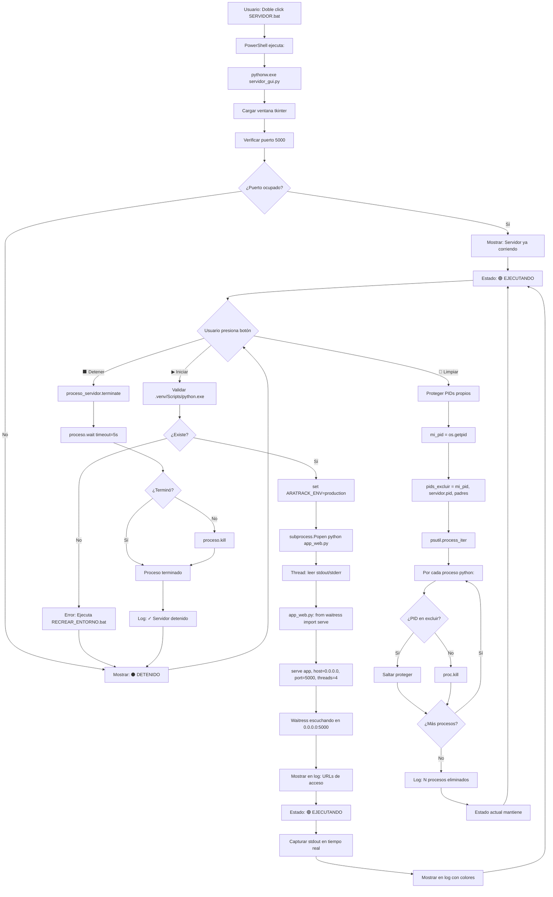

---

## 10. FLUJO DE CONCURRENCIA EN SQLite

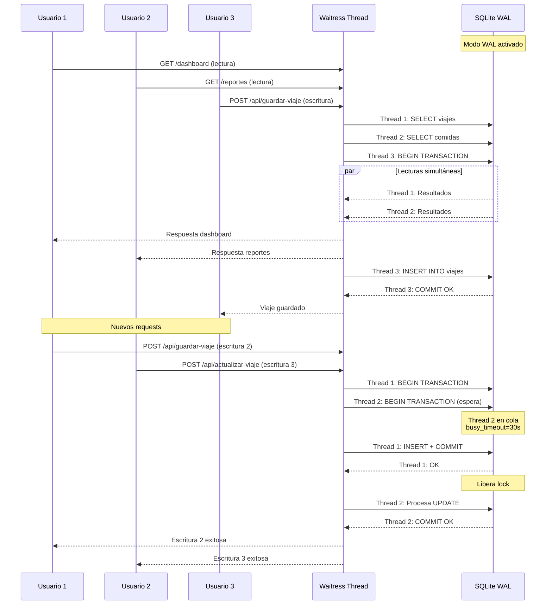

---

## 11. FLUJO DE MANEJO DE ERRORES

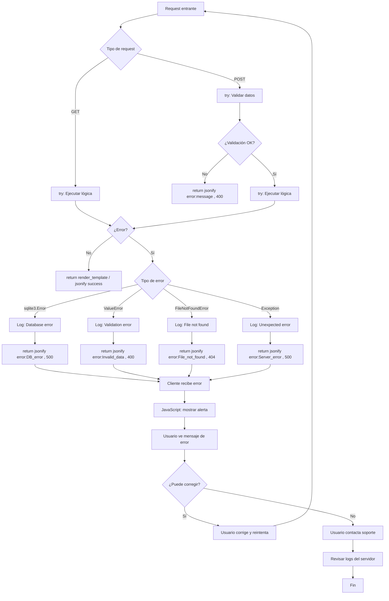

---

## 12. DIAGRAMA DE COMPONENTES

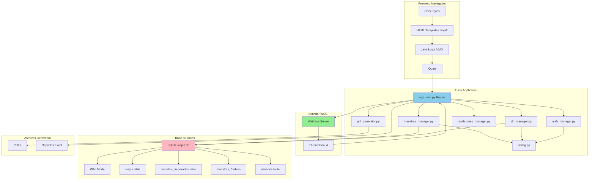

---

*Documento generado automáticamente el 27 de Febrero de 2026*

**Nota**: Los diagramas Mermaid pueden ser visualizados en:
- GitHub
- VS Code con extensión Mermaid Preview
- Herramientas online: mermaid.live
